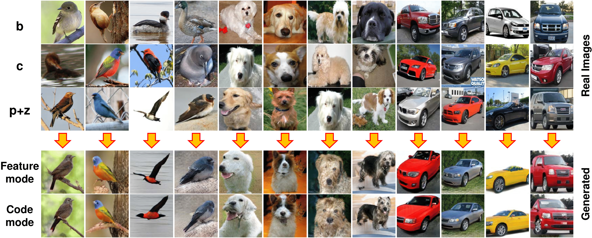
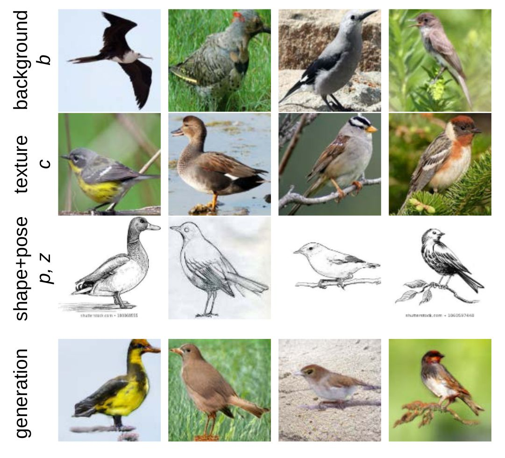

# MixNMatch: Multifactor Disentanglement and Encoding for Conditional Image Generation <br> [[Paper]](https://arxiv.org/abs/1911.11758)

[Yuheng Li](https://github.com/Yuheng-Li),
[Krishna Kumar Singh](http://krsingh.cs.ucdavis.edu/),
[Utkarsh Ojha](https://utkarshojha.github.io/),
[Yong Jae Lee](https://web.cs.ucdavis.edu/~yjlee/)<br>
UC Davis <br>
In [arXiv, 2019](https://arxiv.org/abs/1911.11758)

The code and pre-trained models will be released soon. <br>

## Demo Video

[](https://www.youtube.com/watch?v=w36vnkIbyjs)


## Requirements
- Linux
- Python 3.7
- Pytorch 1.3.1
- NVIDIA GPU + CUDA CuDNN

## Getting started
### Clone the repository
```bash
git clone https://github.com/Yuheng-Li/MixNMatch.git
cd MixNMatch
```
### Setting up the data

Download the formatted CUB data from this [link](https://drive.google.com/file/d/1ardy8L7Cb-Vn1ynQigaXpX_JHl0dhh2M/view?usp=sharing) and extract it inside the `data` directory

### Downloading pretrained models

Pretrained models for CUB are available at this [link](https://drive.google.com/open?id=1c4NtKyccBNDuh_vqB-KlzZpRv9cQxEI7). Download and extract them in the `models` directory.


## Evaluating the model
In `code`
- Run `python eval.py --z path_to_pose_source_images --b path_to_bg_source_images --p path_to_shape_source_images --c path_to_color_source_images --out path_to_ourput --mode code_or_feature --models path_to_pretrained_models`
- For example `python eval.py --z z --b b --p p --c c --mode code --models ../models`
  - **NOTE**: Note that (1) in feature mode pose source images will be ignored; (2) Generator, Encoder and Feature_extractor in models folder should be named as G.pth, E.pth and EX.pth  

## Training your own model
In `code/config.py`:
- Specify the dataset location in `DATA_DIR`.
  - **NOTE**: If you wish to train this on your own (different) dataset, please make sure it is formatted in a way similar to the CUB dataset that we've provided.
- Specify the number of super and fine-grained categories that you wish for FineGAN to discover, in `SUPER_CATEGORIES` and `FINE_GRAINED_CATEGORIES`.
- For the first stage training run `python train_first_stage.py output_name`
- For the second stage training run `python train_second_stage.py output_name path_to_pretrained_G path_to_pretrained_E`
  - **NOTE**:  output will be in `output/output_name`


## Results

### 1. Extracting all factors from differnet real images to synthesize a new image

<br>

### 2. Comparison between the feature and code mode

<br>

### 3. Manipulating real images by varying a single factor

<br>

### 4. Inferring style from unseen data
Cartoon -> image             |  Sketch -> image
:-------------------------:|:-------------------------:
  |  
<br>

### 5. Converting a reference image according to a reference video
<p align="center">

</p>
<br>

## Citation
If you find this useful in your research, consider citing our work:
```
@inproceedings{li-arxiv2019,
  title = {MixNMatch: Multifactor Disentanglement and Encoding for Conditional Image Generation},
  author = {Yuheng Li and Krishna Kumar Singh and Utkarsh Ojha and Yong Jae Lee},
  booktitle = {arXiv},
  year = {2019}
}
```

