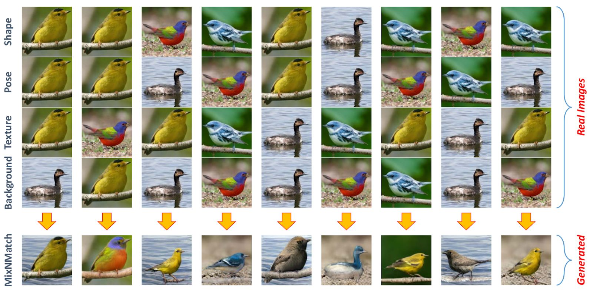
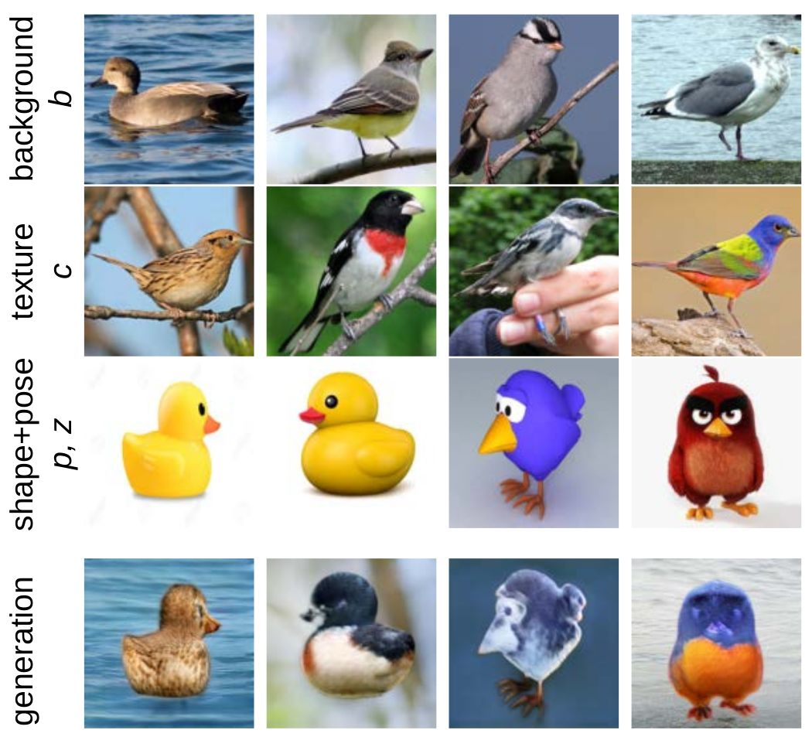

# MixNMatch: Multifactor Disentanglement and Encoding for Conditional Image Generation

[Yuheng Li](https://github.com/Yuheng-Li),
[Krishna Kumar Singh](http://krsingh.cs.ucdavis.edu/),
[Utkarsh Ojha](https://utkarshojha.github.io/),
[Yong Jae Lee](https://web.cs.ucdavis.edu/~yjlee/)<br>
UC Davis <br>
In [arXiv, 2019](#)

The code and pre-trained models will be released soon. <br>

## Demo Video

[](https://www.youtube.com/watch?v=j2rmVVxCgL8)

## Results

### 1. Extracting all factors from differnet real images to synthesize a new image

<br>

### 2. Comparison between the feature and code mode

<br>

### 3. Manipulating real images by varying a single factor

<br>

### 4. Inferring style from unseen data
Cartoon -> image             |  Sketch -> image
:-------------------------:|:-------------------------:
  |  
<br>

### 5. Converting a reference image according to a reference video
<p align="center">

</p>
<br>

## Citation
If you find this useful in your research, consider citing our work:
```
@inproceedings{li-arxiv2019,
  title = {MixNMatch: Multifactor Disentanglement and Encoding for Conditional Image Generation},
  author = {Yuheng Li and Krishna Kumar Singh and Utkarsh Ojha and Yong Jae Lee},
  booktitle = {arXiv},
  year = {2019}
}
```

